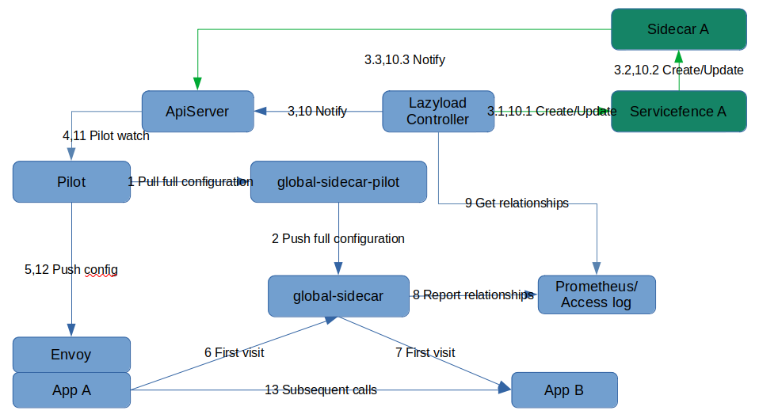

- [Lazyload Overview](#lazyload-overview)
  - [Features](#features)
  - [Backgroud](#backgroud)
  - [Thinking](#thinking)
  - [Architecture](#architecture)
  - [Install & Use](#install--use)
  - [Introduction of other features](#introduction-of-other-features)
  - [Example](#example)
  - [E2E Test Introduction](#e2e-test-introduction)
  - [ServiceFence Instruction](#servicefence-instruction)

# Lazyload Overview

[中文](./README_zh.md)

## Features

1. Simple pass through forwarding design, independent of the number of services, no performance issues
2. Pass through forwarding supports all traffic governance capabilities
3. Suitable for scenarios where out-of-cluster services exist
4. Support manual, automatic and other enable lazyload methods
5. Supports multiple enable scopes like service level, namespace level, etc.

## Backgroud

When there are too many services in cluster, envoy configuration is too much, and the new application will be in NotReady state for a long time. Configuring CR Sidecar for new application and automatically fetching the service dependencies and updating Sidecar can solve this problem.

## Thinking

Bring another Sidecar, the global-sidecar, which is a globally shared Sidecar with a full configuration and service discovery information. The pass through route is replaced with a new one to the global-sidecar.

Global-sidecar requires some custom configuration, so global-sidecar-pilot is introduced. Global-sidecar-pilot generates configuration for global-sidecar based on the pilot configuration in the cluster.

Bring new CR ServiceFence. Details at [ServiceFence Instruction](#ServiceFence Instruction)

Finally, the control logic is included in the lazyload controller component. It will create ServiceFence and Sidecar for the lazyload enabled services, and update ServiceFence and Sidecar based on the service invocation relationship obtained from the configuration.

## Architecture

Details at [Architecture](./lazyload_tutorials.md#Architecture)

## Install & Use

Lazyload has 3 using modes: 

- Use namespace level global-sidecar
- Use cluster unique global-sidecar
- Disable global-sidecar

Details at [Install&Use](./lazyload_tutorials.md#install-and-use)

## Introduction of other features

- Automatic ServiceFence generation based on namespace/service label

- Custom undefined traffic dispatch

Details at [Introduction of other features](./lazyload_tutorials.md#Introduction-of-other-features)

## Example

Details at [Example](./lazyload_tutorials.md#Example)

## E2E Test Introduction

When developmenting, the module function can be verified correctly through E2E testing.

Details at [E2E Test Tutorials](https://github.com/slime-io/slime/blob/master/doc/en/slime_e2e_test.md)

## ServiceFence Instruction

ServiceFence can be seen as a Sidecar resource for a service. The difference is that ServiceFence not only generates Sidecar resources based on dependencies, but also determines the real backend of the service based on VirtualService rules and automatically expands the scope of Fence.

For example, c.default.svc.cluster.local is in servicefence. Now a route has a host of c.default.svc.cluster.local, the destination chagnes to d.default.svc.cluster.local. Then service d will be included in servicefence.

