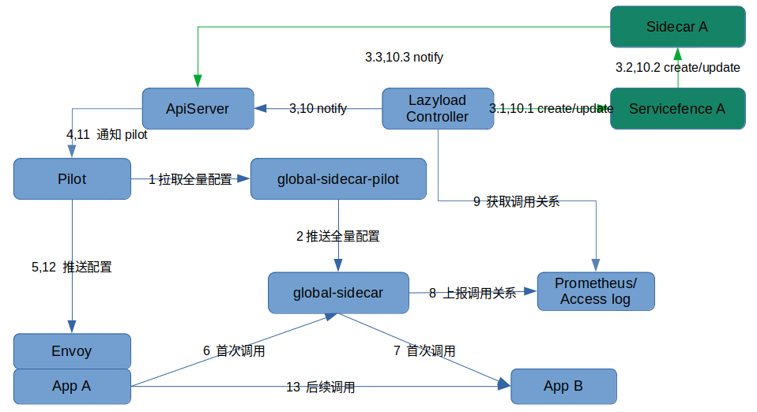
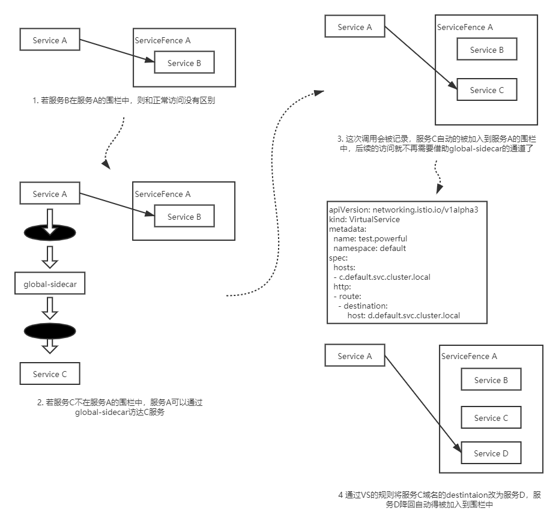

- [懒加载概述](#懒加载概述)
  - [特点](#特点)
  - [背景](#背景)
  - [思路](#思路)
  - [架构](#架构)
  - [安装和使用](#安装和使用)
  - [其他特性介绍](#其他特性介绍)
  - [完整使用样例](#完整使用样例)
  - [ServiceFence说明](#servicefence说明)

# 懒加载概述

## 特点

1. 兜底逻辑简单，与服务数量无关，无性能问题
2. 兜底转发支持所有流量治理能力
3. 适用存在集群外服务的场景
4. 支持手动、自动等多种启用方式
5. 支持服务级、命名空间级等多种启用范围

## 背景

懒加载即按需加载。

没有懒加载时，服务数量过多时，Envoy配置量太大，新上的应用长时间处于Not Ready状态。为应用配置CR Sidecar，并自动的获取服务依赖关系，更新Sidecar可以解决此问题。

## 思路

引入另一个Sidecar，即global-sidecar。它是一个全局共享的Sidecar，拥有全量的配置和服务发现信息。兜底路由替换为指向global-sidecar的新兜底路由。

出于global-sidecar的兜底逻辑不能继续指向自身导致死循环等考虑，global-sidecar需要一些定制化配置，因此引入global-sidecar-pilot。global-sidecar-pilot会基于集群中的pilot配置生成专用于global-sidecar的配置。

引入新的CR资源ServiceFence。详见[ServiceFence说明](#ServiceFence说明)

最后，将控制逻辑包含到lazyload controller组件中。它会为启用懒加载的服务创建ServiceFence和Sidecar，根据配置获取到服务调用关系，更新ServiceFence和Sidecar。

## 架构

具体的细节说明可以参见[架构](./lazyload_tutorials_zh.md#%E6%9E%B6%E6%9E%84)

## 安装和使用

lazyload目前有三种使用模式：

- 使用namespace级别的global-sidecar
- 使用集群唯一的global-sidecar   
- 不使用global-sidecar组件

详见 [安装和使用](./lazyload_tutorials_zh.md#%E5%AE%89%E8%A3%85%E5%92%8C%E4%BD%BF%E7%94%A8)

## 其他特性介绍

- ServiceFence支持手动创建和基于namespace/service label自动创建

- 支持自定义兜底流量分派

详见 [其他特性介绍](./lazyload_tutorials_zh.md#%E5%85%B6%E4%BB%96%E7%89%B9%E6%80%A7%E4%BB%8B%E7%BB%8D)

## 完整使用样例

详见 [示例: 为bookinfo的productpage服务开启懒加载](./lazyload_tutorials_zh.md#%E7%A4%BA%E4%BE%8B)

## ServiceFence说明

ServiceFence可以看作是针对某一服务的Sidecar资源，区别是ServiceFence不仅会根据依赖关系生成Sidecar资源，同时会根据VirtualService规则判断服务的真实后端，并自动扩大Fence的范围。

例如，c.default.svc.cluster.local在fence中。此时有一条路由规则的host为c.default.svc.cluster.local，其destinatoin为d.default.svc.cluster.local，那么d服务也会被自动扩充到Fence中。

